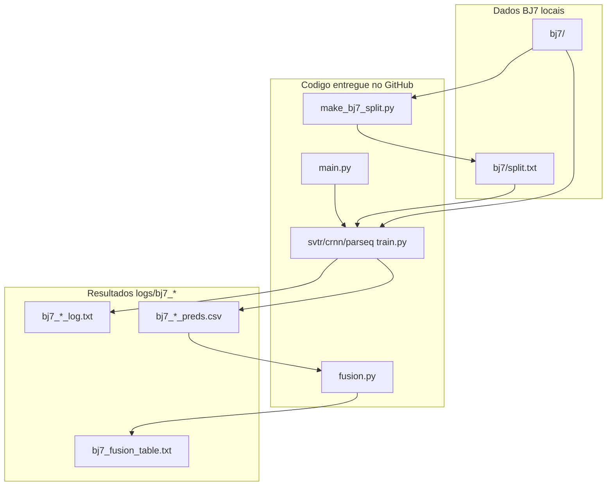

# TCC — OCR de placas veiculares

Repositório do Trabalho de Conclusão de Curso para **reconhecimento óptico de caracteres (OCR)** em placas de veículos. O objetivo é comparar arquiteturas de deep learning em datasets reais e, no caso do BJ7, **fundir predições de múltiplos modelos e múltiplas imagens por veículo** para aumentar a acurácia final.

Este documento cobre o caminho completo: **fundamentação teórica → dados → pré-processamento → treino → avaliação → fusão → artefatos de saída**.

---

## Entrega de artefatos (BJ7 / ICPR)

**Repositório:** este repositório GitHub.

Escopo desta entrega: experimentos, dados, logs e fusão do dataset **BJ7 (ICPR)**. Todos os arquivos e resultados relevantes estão organizados nos diretórios abaixo.



### Código-fonte e scripts

| Artefato | Função | Parâmetros / como executar |
|----------|--------|----------------------------|
| [`main.py`](main.py) | Orquestrador: treino + teste por modelo (`bj7_svtr`, `bj7_crnn`, `bj7_parseq`) e fusão ao final | Configurar `_DATASETS=["bj7"]` e `_MODELS` no topo do arquivo; parâmetros em `obter_parametros()`. Sem CLI — executar com `python main.py` |
| [`svtr/train.py`](svtr/train.py) | Script de treinamento e avaliação do **SVTR** no BJ7 | Chamado por `main.py`. Entrada: `data_root=bj7/`. Saída: `logs/bj7_svtr/` |
| [`crnn/train.py`](crnn/train.py) | Script de treinamento e avaliação do **CRNN** no BJ7 | Chamado por `main.py`. Entrada: `data_root=bj7/`. Saída: `logs/bj7_crnn/` |
| [`parseq/train.py`](parseq/train.py) | Script de treinamento e avaliação do **PARSeq** no BJ7 | Chamado por `main.py`. Entrada: `data_root=bj7/`. Saída: `logs/bj7_parseq/`. Opções PARSeq em `obter_parametros()` |
| [`make_bj7_split.py`](make_bj7_split.py) | Gera a partição train/val/test em `bj7/split.txt` (80/20, seed 42) | `python make_bj7_split.py` — executar **antes** do treino |
| [`fusion.py`](fusion.py) | Fusão MV e MVCP (intra-modelo e inter-modelos) a partir dos CSVs de teste | `python fusion.py` ou automático ao final de `main.py` |
| [`requirements.txt`](requirements.txt) | Dependências do ambiente Python | `pip install -r requirements.txt` |

### Dados e pré-processamento

| Artefato | Função | Observação |
|----------|--------|------------|
| `./bj7/` | Dataset **ICPR (BJ7)** — tracks, imagens HR/LR e `annotations.json` | Não versionado (`.gitignore`); deve ser colocado localmente antes do treino |
| `./bj7/split.txt` | Listagem de tracks por split (`training`, `validation`, `testing`) | Gerado por `make_bj7_split.py`; usado por todos os `BJ7Dataset` |

### Resultados, logs e métricas

| Artefato | Função | Conteúdo |
|----------|--------|----------|
| `./logs/bj7_svtr/` | Saídas do run SVTR no BJ7 | Logs, predições e (localmente) checkpoint |
| `./logs/bj7_crnn/` | Saídas do run CRNN no BJ7 | Idem |
| `./logs/bj7_parseq/` | Saídas do run PARSeq no BJ7 | Idem |
| `./logs/bj7_parseq/bj7_parseq_log.txt` | Log de treino, validação e teste | Épocas, loss, acurácias; linha final com `test_acc` |
| `./logs/bj7_parseq/bj7_parseq_preds.csv` | Predições por imagem no conjunto de teste | 15 000 linhas (3 000 tracks × 5 LR). Colunas: `track_id`, `image_type`, `image_idx`, `gt`, `pred`, `conf_seq`, `conf_chars` |
| `./logs/bj7_fusion_table.txt` | Tabela consolidada de fusão (MV e MVCP) | Acurácias HR/LR por modelo e fusão inter-modelos |

> **Checkpoints** (`logs/bj7_*/*_best.pt`): produzidos durante o treino, mas **não fazem parte desta entrega GitHub** (arquivos grandes, excluídos no `.gitignore`). Para reavaliar com pesos locais, usar `eval_only=True` em `obter_parametros()`.

> **Métricas auxiliares:** não há `results.xlsx`, figuras ou matrizes de confusão. As métricas experimentais estão em `*_log.txt`, `*_preds.csv` e `bj7_fusion_table.txt`.

### Documentação auxiliar

| Artefato | Função |
|----------|--------|
| [`docs/pipeline.md`](docs/pipeline.md) | Diagramas Mermaid e descrição detalhada do pipeline BJ7 |
| [`gerar_pipeline_doc.py`](gerar_pipeline_doc.py) | Regenera `docs/pipeline.md` a partir do código |

### Parâmetros de execução (padrão congelado)

Definidos em `obter_parametros()` dentro de [`main.py`](main.py):

| Parâmetro | Valor | Descrição |
|-----------|-------|-----------|
| `_DATASETS` | `["bj7"]` | Dataset da entrega |
| `_MODELS` | `["svtr", "crnn", "parseq"]` | Modelos a executar (editável) |
| `seed` | `42` | Semente global |
| `batch_size` | `64` | Tamanho do batch |
| `epochs` | `30` | Épocas máximas |
| `learning_rate` | `0.0005` | Taxa de aprendizado |
| `min_epochs` | `10` | Warmup antes de scheduler/early stop |
| `lr_patience` | `3` | Épocas sem melhora para reduzir LR |
| `lr_factor` | `0.1` | Fator de redução do LR |
| `early_stop_patience` | `3` | Épocas após redução de LR até parar |
| `warp_w × warp_h` | `256 × 64` | Entrada SVTR/CRNN no BJ7 |
| `parseq_variant` | `parseq_tiny` | Variante PARSeq (~6M parâmetros) |
| `parseq_pretrained` | `False` | Treino do zero (sem pesos pré-treinados) |
| `parseq_decode_ar` | `True` | Decodificação autoregressiva |
| `parseq_refine_iters` | `1` | Iterações de refinamento PARSeq |

**Comando de execução completa:**

```bash
python make_bj7_split.py   # uma vez, antes do treino
python main.py             # treina, avalia e gera fusão
```

Decisões experimentais adicionais: ver [seção 12](#12-decisões-experimentais-congeladas).

---

## Sumário

0. [Entrega de artefatos (BJ7 / ICPR)](#entrega-de-artefatos-bj7--icpr)
1. [Contexto e objetivo](#1-contexto-e-objetivo)
2. [Fundamentação teórica](#2-fundamentação-teórica)
3. [Visão geral do pipeline](#3-visão-geral-do-pipeline)
4. [Datasets](#4-datasets)
5. [Pré-processamento e splits](#5-pré-processamento-e-splits)
6. [Modelos implementados](#6-modelos-implementados)
7. [Treino e avaliação](#7-treino-e-avaliação)
8. [Fusão de predições (BJ7)](#8-fusão-de-predições-bj7)
9. [Saídas e artefatos](#9-saídas-e-artefatos)
10. [Como executar](#10-como-executar)
11. [Estrutura do repositório](#11-estrutura-do-repositório)
12. [Decisões experimentais congeladas](#12-decisões-experimentais-congeladas)
13. [Documentação complementar](#13-documentação-complementar)

---

## 1. Contexto e objetivo

### Problema

Em sistemas de **ALPR** (Automatic License Plate Recognition), após detectar e recortar a placa na imagem, é necessário **ler a sequência alfanumérica** (ex.: `ABC1D23`). Isso é um problema de **reconhecimento de texto em cena** (*scene text recognition*), com particularidades:

- Comprimento variável (7 caracteres no padrão Mercosul, 7 no antigo brasileiro, etc.).
- Degradação por blur, oclusão, inclinação e baixa resolução.
- Vocabulário fechado: apenas `A–Z` e `0–9`.

### Objetivo deste repositório

1. Treinar e avaliar **três arquiteturas** (SVTR, CRNN, PARSeq) de forma **isolada** — cada modelo tem pesos, logs e predições próprios.
2. No dataset **BJ7**, explorar **fusão pós-processamento**: combinar as 5 imagens HR e 5 LR de cada *track* (veículo) e, depois, combinar os três modelos.
3. Manter **reprodutibilidade**: seeds fixas, splits versionados, protocolo documentado.

### Escopo atual

| Item | Situação |
|------|----------|
| Dataset **BJ7** (ICPR) | Ativo — treino, avaliação e fusão |
| Dataset **RodoSol** | Suportado no código; ativar em `main.py` |
| Modelos | `svtr`, `crnn`, `parseq` implementados |
| Fusão | Apenas BJ7 (`fusion.py`) |

---

## 2. Fundamentação teórica

### 2.1 OCR de placas como sequência

Dada uma imagem recortada da placa \( I \), o modelo estima uma sequência de caracteres \( \hat{y} = (\hat{y}_1, \ldots, \hat{y}_L) \) que deve coincidir com o ground truth \( y \) após normalização.

**Métrica principal adotada:** *acurácia em nível de placa* — a predição normalizada deve ser **idêntica** ao rótulo (100% dos caracteres corretos). Não usamos CER (Character Error Rate) como métrica oficial nesta fase.

### 2.2 Normalização do texto

Tanto ground truth quanto predições passam pela mesma regra:

- Converter para **maiúsculas**.
- Manter **somente** caracteres alfanuméricos (`A–Z`, `0–9`).
- Remover hífens, pontos, espaços e outros símbolos.

Implementação: `_sanitize_plate()` nos módulos `dataset.py`.

### 2.3 CTC (Connectionist Temporal Classification)

Usado por **SVTR** e **CRNN**.

- A rede emite uma sequência de logits ao longo do eixo horizontal da imagem (eixo temporal \( T \)).
- Um símbolo especial **blank** permite alinhar comprimentos diferentes entre imagem e texto.
- Na inferência, aplica-se decodificação **greedy**: argmax por timestep, removendo blanks e repetições consecutivas.

**Confiança por caractere (CTC):** probabilidade softmax no timestep em que cada caractere foi emitido.  
**Confiança da sequência (`conf_seq`):** média geométrica das confianças por caractere.

### 2.4 PARSeq (Permutation Autoregressive Sequence)

Arquitetura **transformer** com decodificação autoregressiva (via `torch.hub`, repositório `baudm/parseq`).

- Não usa CTC; o modelo prediz tokens de forma sequencial.
- Pode ser instanciado **do zero** (`parseq_pretrained=False`) ou com pesos pré-treinados em scene-text genérico (`parseq_pretrained=True`).
- Entrada padrão: **128×32** px (diferente de SVTR/CRNN).
- Treino com **augmentation** leve (ColorJitter, RandomAffine, GaussianBlur).
- Early stopping monitora **char_acc** (acurácia posicional por caractere), não apenas match exato da placa.

### 2.5 Fusão por voto ponderado

No BJ7, cada *track* gera **10 predições** (5 HR + 5 LR). A fusão combina essas predições (e depois combina modelos) usando dois esquemas:

| Estratégia | Nome | Ideia |
|------------|------|-------|
| **MV** | Voto Majoritário por sequência | Cada imagem vota na **string inteira**; peso = `conf_seq`. |
| **MVCP** | Voto Majoritário por Caractere/Posição | Para cada posição \( i \), vota-se o caractere na posição \( i \) de cada predição; peso = `conf_chars[i]`. |

Em ambos os casos, o vencedor é quem acumula **maior soma de pesos** (empate → primeira ocorrência vence).

**Fusão intra-modelo:** dentro de um mesmo modelo, separando HR e LR.  
**Fusão inter-modelos:** cada modelo produz **1 voto** por track (HR+LR combinados); depois vota-se entre os modelos.

---

## 3. Visão geral do pipeline

```
┌─────────────────────────────────────────────────────────────────────────────┐
│  DADOS                                                                      │
│  bj7/ (tracks + annotations)          rodosol/ (cenas + labels)             │
└───────────────┬─────────────────────────────────────┬───────────────────────┘
                │                                     │
                ▼                                     ▼
┌───────────────────────┐                 ┌───────────────────────┐
│ make_bj7_split.py     │                 │ crop_rodosol.py       │
│ → bj7/split.txt       │                 │ → rodosol/crops/      │
└───────────┬───────────┘                 └───────────┬───────────┘
            │                                         │
            └─────────────────┬───────────────────────┘
                              ▼
┌─────────────────────────────────────────────────────────────────────────────┐
│  main.py  →  loop (modelo × dataset)  →  svtr | crnn | parseq train.py    │
│              treino → checkpoint → avaliação teste → CSV de predições       │
└─────────────────────────────────────────────────────────────────────────────┘
                              │
                              ▼ (somente BJ7)
┌─────────────────────────────────────────────────────────────────────────────┐
│  fusion.py  →  lê CSVs  →  fusão MV + MVCP  →  bj7_fusion_table.txt         │
└─────────────────────────────────────────────────────────────────────────────┘
```

Diagramas detalhados com Mermaid: [`docs/pipeline.md`](docs/pipeline.md) (gerado por `gerar_pipeline_doc.py`).

---

## 4. Datasets

### 4.1 BJ7 (`bj7/`) — dataset ICPR

**BJ7 é o mesmo dataset ICPR** (competição/desafio de reconhecimento de placas). Neste repositório ele fica na pasta `bj7/` por conveniência de caminho e nomenclatura dos runs (`bj7_svtr`, etc.), mas os dados, estrutura e protocolo são os do ICPR.

Dataset sintético/realista com **tracks** (sequências de um mesmo veículo). Cada track contém múltiplas capturas HR e LR da mesma placa.

#### Estrutura de diretórios

```
bj7/
├── train/
│   ├── Scenario-A/
│   │   ├── Brazilian/track_XXXXX/
│   │   └── Mercosur/track_XXXXX/
│   └── Scenario-B/
│       ├── Brazilian/track_XXXXX/
│       └── Mercosur/track_XXXXX/
├── test/
│   └── track_XXXXX/
└── split.txt                    ← gerado por make_bj7_split.py
```

#### Conteúdo de cada track

| Arquivo | Descrição |
|---------|-----------|
| `annotations.json` | `plate_text` (GT), `plate_layout`, metadados |
| `hr-001..005.{png\|jpg}` | 5 imagens **alta resolução** (treino/val apenas) |
| `lr-001..005.{png\|jpg}` | 5 imagens **baixa resolução** (todos os splits) |

**Extensão automática:** Scenario-A usa PNG; Scenario-B e teste usam JPG. O `BJ7Dataset` detecta via presença de `hr-001.png`.

#### Contagens aproximadas

| Split | Tracks | Imagens (aprox.) |
|-------|--------|------------------|
| training | 16 000 | 160 000 (10 img/track) |
| validation | 4 000 | 40 000 |
| testing | 3 000 | 15 000 (somente LR) |

O conjunto de **teste oficial não possui imagens HR** — por isso a fusão HR no teste reporta acurácia 0 (não há amostras HR para fundir).

#### Layouts

- **Brazilian** (padrão antigo) e **Mercosur** coexistem no treino.
- Um único modelo por dataset aprende **ambos** os layouts; comprimentos variam conforme o rótulo.

---

### 4.2 RodoSol-ALPR (`rodosol/`)

Dataset real de cenas 1280×720 com anotações por imagem.

#### Estrutura esperada

```
rodosol/
├── split.txt
├── images/
│   ├── cars-br/
│   ├── cars-me/
│   ├── motorcycles-br/
│   └── motorcycles-me/
│       └── img_XXXXXX.jpg + img_XXXXXX.txt
└── crops/                       ← gerado por crop_rodosol.py
    └── {categoria}/img_XXXXXX.jpg
```

#### Arquivo de label (`.txt`)

Campos relevantes:

- `plate:` texto da placa
- `layout:` Brazilian ou Mercosur
- `corners:` quatro pontos `x,y` separados por espaço

**Ordem dos corners (congelada):** top-left → top-right → bottom-right → bottom-left (sentido horário).

#### Pré-processamento

`crop_rodosol.py` aplica **homografia** (perspectiva) nos quatro corners e gera crops **256×64** px em `rodosol/crops/`. Não há redimensionamento extra após o warp — essa é a entrada dos modelos CTC (SVTR/CRNN).

---

## 5. Pré-processamento e splits

### 5.1 Gerar split do BJ7

```bash
python make_bj7_split.py
```

**Regras (`make_bj7_split.py`):**

- **Seed:** 42
- **Treino interno:** 80% training / 20% validation, **estratificado** por grupo `(Scenario, Categoria)` — ou seja, dentro de cada pasta `Scenario-A/Brazilian`, etc., 80% das tracks vão para training e 20% para validation.
- **Teste:** todas as tracks em `bj7/test/` → split `testing`
- **Saída:** `bj7/split.txt`, uma linha por track:

```
./train/Scenario-A/Brazilian/track_01384;training
./test/track_10002;testing
```

### 5.2 Gerar crops do RodoSol

```bash
python crop_rodosol.py
```

Processa em paralelo todas as imagens de `rodosol/images/` e grava warps 256×64 em `rodosol/crops/`.

### 5.3 Como o DataLoader consome o split

`BJ7Dataset` e `RodoSolDataset` (em `svtr/dataset.py`, `crnn/dataset.py`, `parseq/dataset.py`):

1. Leem `split.txt`.
2. Filtram linhas pelo split desejado (`training`, `validation`, `testing`).
3. Expandem cada track BJ7 em **10 amostras** independentes (hr-001..005 + lr-001..005).
4. Aplicam transformação de imagem (resize + normalização ImageNet).

No treino BJ7, HR e LR são **misturados** como amostras i.i.d. — o modelo não distingue resolução durante o aprendizado.

---

## 6. Modelos implementados

### 6.1 SVTR-Tiny (`svtr/`)

- **Paper:** Du et al., *SVTR: Scene Text Recognition with a Single Visual Model* (2022).
- **Mecanismo:** Transformer híbrido (mixers locais + globais) + cabeça **CTC**.
- **Entrada:** 256×64 px.
- **Parâmetros:** ~2M (Tiny).
- **Treino:** Adam, CTCLoss, monitoramento por `val_acc` (acurácia de placa).

### 6.2 CRNN (`crnn/`)

- **Paper:** Shi et al., *An End-to-End Trainable Neural Network for Image-based Sequence Recognition* (2015).
- **Mecanismo:** CNN + BiLSTM × 2 + **CTC**.
- **Entrada:** 256×64 px.
- **Baseline clássico** para comparação com arquiteturas mais recentes.

### 6.3 PARSeq-Tiny (`parseq/`)

- **Paper:** Bautista & Atienza, *Scene Text Recognition with Permuted Autoregression* (2022).
- **Mecanismo:** Transformer autoregressivo via `torch.hub.load("baudm/parseq", ...)`.
- **Entrada:** 128×32 px.
- **Variante padrão:** `parseq_tiny` (~6M parâmetros).
- **Treino:** AdamW, loss nativa do PARSeq, early stopping por `char_acc`.

### 6.4 Vocabulário compartilhado (CTC)

```
blank = 0
'0'–'9' = 1–10
'A'–'Z' = 11–36
Total: 37 classes
```

PARSeq usa o tokenizer próprio do hub (charset compatível com alfanuméricos).

### 6.5 Matriz de experimentos

Cada combinação `dataset × modelo` é um **run** independente:

| Run | Dataset | Modelo |
|-----|---------|--------|
| `bj7_svtr` | BJ7 | SVTR |
| `bj7_crnn` | BJ7 | CRNN |
| `bj7_parseq` | BJ7 | PARSeq |
| `rodosol_svtr` | RodoSol | SVTR |
| `rodosol_crnn` | RodoSol | CRNN |
| `rodosol_parseq` | RodoSol | PARSeq |

Nomes de pasta e arquivos seguem `{dataset}_{modelo}`.

---

## 7. Treino e avaliação

### 7.1 Orquestração (`main.py`)

- **Entrada:** `python main.py` (sem CLI; parâmetros em `obter_parametros()`).
- Loop aninhado: `_MODELS × _DATASETS`.
- Se um run falhar, os demais continuam; ao final imprime resumo de status.
- Se `bj7` estiver nos datasets, executa `fusion.run_fusion()` automaticamente.

**Configuração atual (editável no topo de `main.py`):**

```python
_DATASETS = ["bj7"]
_MODELS = ["parseq"]   # opções: "svtr", "crnn", "parseq"
```

### 7.2 Hiperparâmetros padrão (`obter_parametros`)

| Parâmetro | Valor | Descrição |
|-----------|-------|-----------|
| `seed` | 42 | Reprodutibilidade |
| `batch_size` | 64 | Tamanho do batch |
| `epochs` | 30 | Épocas máximas |
| `learning_rate` | 5e-4 | LR inicial |
| `min_epochs` | 10 | Warmup antes de scheduler/early stop |
| `lr_patience` | 3 | Épocas sem melhora para reduzir LR |
| `lr_factor` | 0.1 | Fator de redução do LR (1×) |
| `early_stop_patience` | 3 | Épocas após redução de LR até parar |
| `warp_w × warp_h` | 256×64 | Entrada SVTR/CRNN/RodoSol |
| `parseq_variant` | `parseq_tiny` | Variante PARSeq |
| `parseq_pretrained` | `False` | Treino do zero (comparável ao SVTR) |

> **Nota:** o PARSeq costuma precisar de schedule mais longo em treinos do zero. Se a convergência for lenta, aumente `epochs`, `min_epochs`, `lr_patience` e `early_stop_patience` em `obter_parametros()`. Detalhes em [`docs/pipeline.md`](docs/pipeline.md).

### 7.3 Ciclo de treino (comum)

1. Carregar datasets train / val / test via `split.txt`.
2. Loop de épocas: forward → loss → backward (clip grad = 5.0).
3. Avaliar no validation a cada época.
4. Salvar melhor checkpoint (`{run_name}_best.pt`) quando a métrica de validação melhora.
5. **Scheduler em duas fases:**
   - Após `min_epochs`, se não houver melhora por `lr_patience` épocas → reduz LR uma vez.
   - Se ainda não houver melhora por `early_stop_patience` épocas → early stop.
6. Recarregar melhor checkpoint e avaliar no **teste**.
7. (BJ7) Gerar CSV de predições por imagem.

### 7.4 Métricas

| Métrica | Onde | Definição |
|---------|------|-----------|
| `val_acc` / `seq_acc` | Validação e teste | % placas com match exato pós-normalização |
| `char_acc` | PARSeq | % caracteres corretos posição a posição |
| Fusão HR/LR/inter | `fusion.py` | Acurácia por track após voto ponderado |

---

## 8. Fusão de predições (BJ7)

Implementada em `fusion.py`. Executada automaticamente ao final de `main.py` (ou manualmente: `python fusion.py`).

### 8.1 Entrada: CSV por modelo

Cada modelo gera `logs/bj7_{modelo}/bj7_{modelo}_preds.csv` com **uma linha por imagem**:

| Coluna | Exemplo | Significado |
|--------|---------|-------------|
| `track_id` | `track_10002` | Identificador da track |
| `image_type` | `lr` ou `hr` | Resolução |
| `image_idx` | `1..5` | Índice dentro do tipo |
| `gt` | `AQE0422` | Ground truth normalizado |
| `pred` | `AQE0422` | Predição do modelo |
| `conf_seq` | `0.978110` | Confiança da sequência (média geométrica) |
| `conf_chars` | `0.9982\|0.9149\|...` | Confiança por caractere |

**Camada de desacoplamento:** a fusão lê **somente os CSVs**. Você pode alterar `fusion.py` ou reprocessar fusões **sem retreinar** modelos.

### 8.2 Fusão intra-modelo (por track)

Para cada modelo e cada track:

```
HR fusion:  weighted_vote nas 5 predições HR  → acerta se vencedor == gt
LR fusion:  weighted_vote nas 5 predições LR  → acerta se vencedor == gt
```

Mesma lógica para MV e MVCP (com pesos diferentes).

### 8.3 Fusão inter-modelos

Para cada track:

1. Cada modelo agrega suas 10 imagens (HR+LR) em **1 voto** (`_combined_track_mv` ou `_combined_track_mvcp`).
2. Voto final entre modelos via `weighted_vote`, peso = confiança acumulada do voto vencedor de cada modelo.
3. Acurácia calculada apenas nas tracks presentes em **todos** os CSVs disponíveis.

### 8.4 Onde HR e LR se misturam

| Etapa | HR isolado | LR isolado | HR+LR misturados |
|-------|:----------:|:----------:|:----------------:|
| Treino | — | — | ✓ (amostras independentes) |
| Dump CSV | — | — | ✓ (coluna `image_type`) |
| Fusão intra HR/LR | ✓ / ✓ | ✓ / ✓ | ✗ |
| Fusão inter-modelos | — | — | ✓ (1 voto por modelo) |

### 8.5 Saída: tabela de fusão

Arquivo: `logs/bj7_fusion_table.txt`

Contém duas seções (MV e MVCP), cada uma com:

- Acurácia HR fusion, LR fusion e número de tracks **por modelo**.
- Acurácia da **fusão inter-modelos** (requer ≥ 2 CSVs).

Exemplo de leitura:

```
== MV (Voto Majoritario por sequencia, peso = conf_seq) ==
Modelo   | HR fusion | LR fusion | Tracks
parseq   |   0.0000  |   0.6827  |  3000
Fusao inter-modelos: Acuracia por track: 0.7127 (3000 tracks)
```

HR fusion = 0 no teste porque **não existem imagens HR** no split `testing`.

---

## 9. Saídas e artefatos

Resumo técnico detalhado. Para o índice de entrega ao professor (escopo BJ7/ICPR), ver [Entrega de artefatos](#entrega-de-artefatos-bj7--icpr).

Por run (`logs/{dataset}_{modelo}/`):

| Arquivo | Conteúdo |
|---------|----------|
| `{run}_best.pt` | Pesos do melhor checkpoint (validação) |
| `{run}_log.txt` | Histórico época a época (loss, métricas val; linha final com teste) |
| `{run}_preds.csv` | Predições detalhadas no teste (**somente BJ7**) |

Global (BJ7):

| Arquivo | Conteúdo |
|---------|----------|
| `logs/bj7_fusion_table.txt` | Tabela MV + MVCP, intra e inter modelos |

### Formato do log (SVTR/CRNN)

```csv
epoch,train_loss,val_acc
...
test_acc,0.654321
```

### Formato do log (PARSeq)

```csv
epoch,train_loss,val_seq_acc,val_char_acc
...
test_acc,0.682700,0.912345
```

---

## 10. Como executar

### 10.1 Ambiente

```bash
pip install -r requirements.txt
```

Dependências principais: PyTorch, torchvision, OpenCV, timm, Pillow.

GPU CUDA recomendada; o código faz fallback para MPS (Apple Silicon) ou CPU.

### 10.2 Preparar dados (primeira vez)

```bash
# BJ7: colocar dataset em bj7/ e gerar split
python make_bj7_split.py

# RodoSol (opcional): colocar dataset em rodosol/ e gerar crops
python crop_rodosol.py
```

### 10.3 Treinar e avaliar

1. Editar `_MODELS` e `_DATASETS` em `main.py`.
2. Ajustar hiperparâmetros em `obter_parametros()` se necessário.
3. Executar:

```bash
python main.py
```

### 10.4 Só fusão (sem retreinar)

```bash
python fusion.py
```

Lê CSVs existentes em `logs/bj7_*/` e regenera `bj7_fusion_table.txt`.

### 10.5 Só avaliação (checkpoint existente)

Em `obter_parametros()`, definir:

```python
eval_only = True
resume = None  # usa {run}_best.pt já salvo em out_dir
```

---

## 11. Estrutura do repositório

```
ml/
├── main.py                 # Orquestrador: loop modelo×dataset + fusão BJ7
├── make_bj7_split.py       # Gera bj7/split.txt
├── crop_rodosol.py         # Warp RodoSol → crops 256×64
├── fusion.py               # Fusão MV/MVCP intra e inter modelos
├── gerar_pipeline_doc.py   # Regenera docs/pipeline.md
├── requirements.txt
│
├── svtr/                   # SVTR-Tiny + CTC
│   ├── model.py
│   ├── dataset.py
│   └── train.py
├── crnn/                   # CRNN + CTC
│   ├── model.py
│   ├── dataset.py
│   └── train.py
├── parseq/                 # PARSeq via torch.hub
│   ├── model.py
│   ├── dataset.py
│   └── train.py
│
├── bj7/                    # Dataset BJ7 (não versionado)
├── rodosol/                # Dataset RodoSol (não versionado)
│
├── logs/                   # Saídas dos experimentos
│   ├── bj7_svtr/
│   ├── bj7_crnn/
│   ├── bj7_parseq/
│   └── bj7_fusion_table.txt
│
└── docs/
    ├── pipeline.md         # Diagramas Mermaid do pipeline
    └── pipeline.html
```

---

## 12. Decisões experimentais congeladas

Alterar qualquer item abaixo implica **nova bateria de experimentos** documentada.

| Tema | Decisão |
|------|---------|
| Seed global | `42` (`random`, `numpy`, `torch`) |
| Split BJ7 | Seed `42`; 80/20 train/val estratificado por `(Scenario, Categoria)`; teste = pasta `bj7/test/` |
| Imagens por track (BJ7) | Todas `hr-*` e `lr-*` do track entram no split correspondente |
| Warp RodoSol | Homografia → **256×64** px; corners TL→TR→BR→BL |
| Normalização texto | Maiúsculas; só `A–Z` e `0–9` |
| Charset modelo | `A–Z`, `0–9` (+ blank para CTC) |
| Métrica principal | Acurácia de placa (match exato) |
| Fusão BJ7 | MV e MVCP ponderados por confiança |
| Isolamento de modelos | Treino, checkpoint e CSV separados; fusão só em pós-processamento |

---

## 13. Documentação complementar

- **[`docs/pipeline.md`](docs/pipeline.md)** — diagramas Mermaid, contagens de amostras, detalhes de scheduler PARSeq vs CTC, exemplos numéricos de voto ponderado. Regenerar com `python gerar_pipeline_doc.py`.
- **`docs/pipeline.html`** — mesma documentação em HTML.

---

## Referências bibliográficas

1. Shi, B., et al. (2015). *An End-to-End Trainable Neural Network for Image-based Sequence Recognition.* IEEE TPAMI.
2. Du, Y., et al. (2022). *SVTR: Scene Text Recognition with a Single Visual Model.* IJCAI.
3. Bautista, D. & Atienza, R. (2022). *Scene Text Recognition with Permuted Autoregression.* CVPR (PARSeq).
